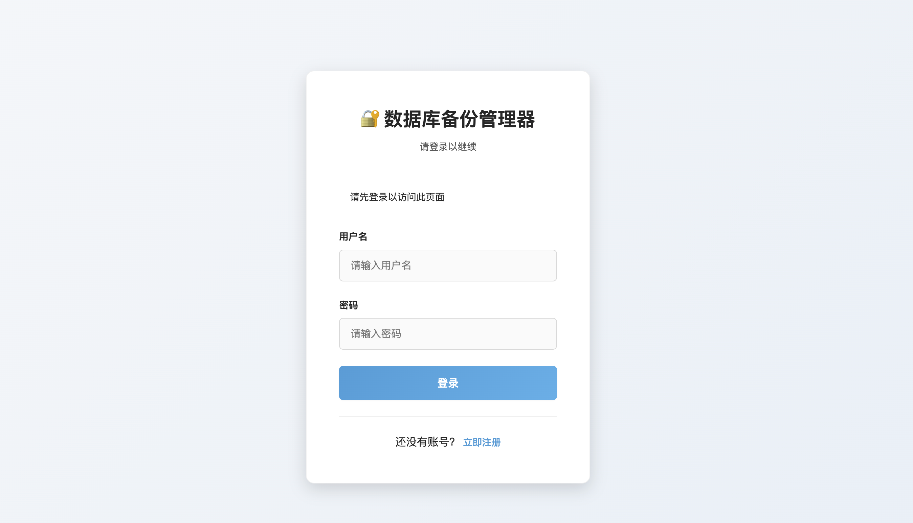
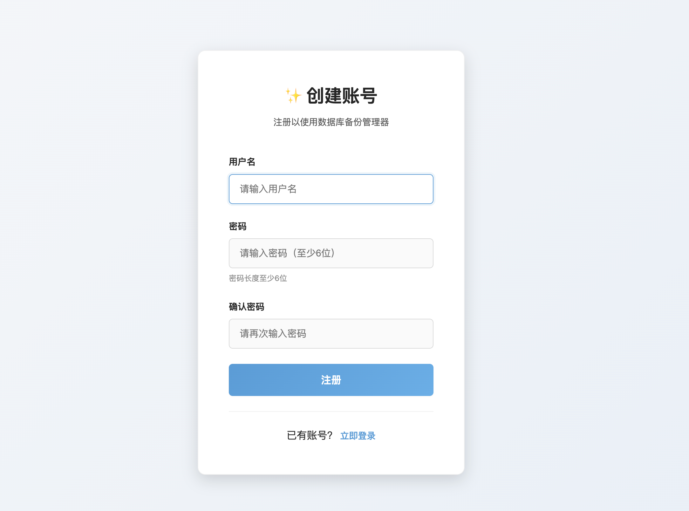
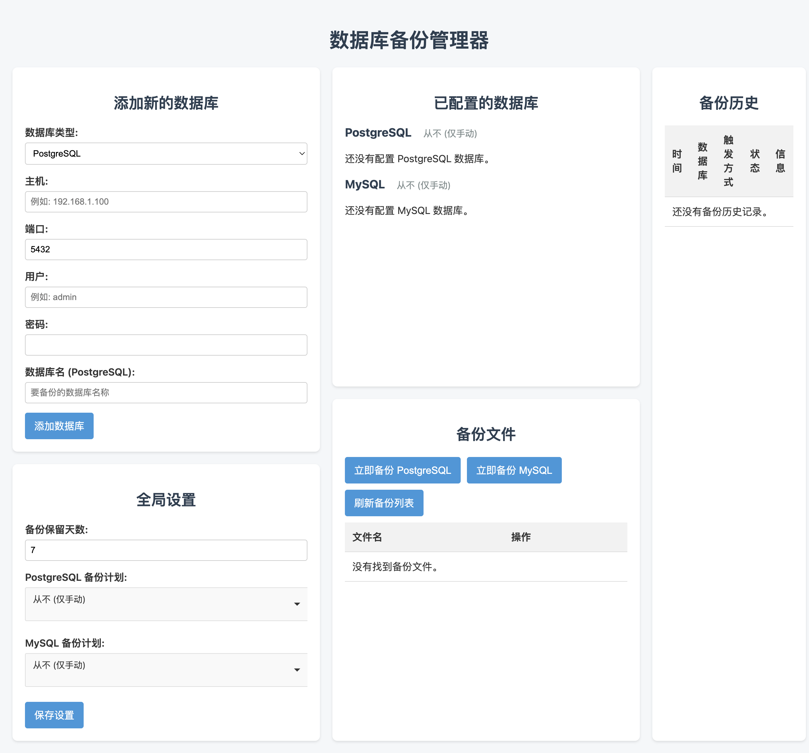
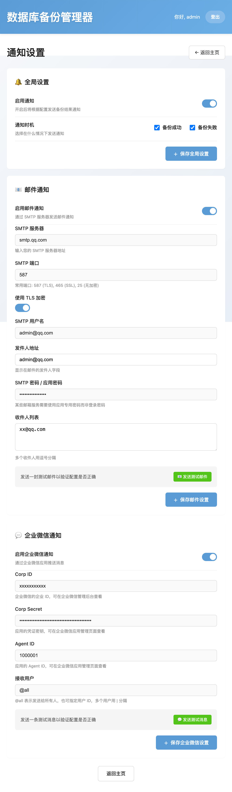

# 数据库备份代理 (db-backup-agent)

一个轻量级、易部署的数据库备份管理工具，通过简洁的 Web 界面实现 PostgreSQL 和 MySQL 的自动化备份管理。无需编写复杂的脚本或记忆繁琐的命令行，即可在浏览器中轻松完成数据库备份策略的配置与管理。

## ✨ 主要功能

### 🎯 核心特性

- **Web 可视化管理** - 通过直观的 Web 界面完成所有操作，无需命令行交互
- **多数据库支持** - 同时支持 PostgreSQL 和 MySQL 数据库备份
- **灵活的备份策略** - 支持按天、周、月设置自动备份计划，亦可随时手动触发
- **智能保留策略** - 自定义备份文件保留天数，自动清理过期备份，节省存储空间
- **完整的备份记录** - 详细记录每次备份的执行时间、触发方式、状态和结果
- **系统日志查看** - 实时查看系统运行日志，方便故障排查
- **📝 更新日志** - Web 界面查看版本更新说明和新功能介绍
- **便捷的故障排查** - 失败任务提供详细错误日志，快速定位问题根源
- **多平台兼容** - 支持 **x86_64 (amd64)** 和 **ARM64** 架构（如 Apple Silicon、树莓派）
- **🔔 消息通知** - 支持邮件和企业微信通知，备份结果自动推送

### 📢 通知功能

系统支持在备份完成时发送通知，让您及时了解备份状态：

#### 支持的通知方式

1. **邮件通知**
   - 支持自定义 SMTP 服务器（如 Gmail、QQ 邮箱、163 邮箱等）
   - 支持 TLS/SSL 加密连接
   - 支持多个收件人
   - 纯文本格式，兼容性更好
   - 可发送测试邮件验证配置

2. **企业微信通知**
   - 通过企业微信应用推送消息
   - 支持 @all 或指定用户
   - 纯文本格式消息，兼容手机端和 PC 端
   - 支持发送测试消息
   - Token 自动缓存和刷新机制

#### 通知配置

1. 访问 Web 界面，点击右上角的 **🔔 通知设置**
2. 启用全局通知开关
3. 选择通知时机：
   - ✅ 备份成功时通知
   - ✅ 备份失败时通知
4. 配置邮件通知或企业微信通知（或两者都配置）
5. 点击测试按钮验证配置
6. 保存配置

#### 企业微信配置步骤

1. 登录企业微信管理后台：https://work.weixin.qq.com/
2. 进入 **应用管理** → 创建应用（或使用现有应用）
3. 记录以下信息：
   - **Corp ID**: 在"我的企业"→"企业信息"中查看
   - **Agent ID**: 在应用详情页面查看
   - **Secret**: 在应用详情页面查看
4. 在通知设置中填写这些信息
5. 选择接收用户（`@all` 表示发送给所有人，或指定用户 ID）

## 📦 镜像标签

**Docker Hub 地址**: https://hub.docker.com/r/tony5188/db-backup-agent

| 标签 | 说明 | 推荐度 |
|------|------|--------|
| `latest` | 同时支持 x86_64 和 ARM64 架构，Docker 自动识别设备架构并拉取对应版本 | ⭐ 推荐 |
| `x86-only` | 仅支持 x86_64 架构的旧版本保留镜像 | 不推荐新用户使用 |

## 🚀 快速开始

### 1. 创建配置文件

创建 `docker-compose.yml` 文件：

```yaml
version: '3.8'

services:
  db-backup-agent:
    image: tony5188/db-backup-agent:latest
    container_name: db-backup-agent
    restart: unless-stopped
    ports:
      - "5001:5001"
    volumes:
      - ./backups:/backups
    environment:
      # 设置时区，确保定时任务在正确的时间执行
      - TZ=Asia/Shanghai

volumes:
  backups:
```

> 💡 **提示**: 镜像已发布至 [Docker Hub](https://hub.docker.com/r/tony5188/db-backup-agent)，可直接使用上述配置。

### 2. 启动服务

在 `docker-compose.yml` 同目录下创建 `backups` 文件夹（用于持久化存储备份文件和配置），然后执行：

```bash
docker-compose up -d
```

### 3. 访问应用

在浏览器中打开 `http://<你的服务器IP>:5001` 即可开始使用。

## 🖼️ 界面预览

### 主界面功能

登录后可以：
- 📊 **数据库管理** - 添加、编辑、删除数据库配置
- ⏰ **备份计划** - 设置自动备份策略（每天、每周、每月）
- 📁 **备份文件** - 查看和下载备份文件
- 📜 **备份历史** - 查看所有备份任务的执行记录
- 📋 **系统日志** - 实时查看系统运行状态
- 🔔 **通知设置** - 配置邮件和企业微信通知
- 📝 **更新日志** - 查看版本更新说明

### 注册页面

首次访问时需要创建管理员账号：





### 主界面

登录后可管理数据库连接和备份任务：



通知界面：



## ⚙️ 配置说明

| 配置项 | 说明 | 必填 |
|--------|------|------|
| **端口映射** | 默认 `5001:5001`，可根据需要修改主机端口 | 否 |
| **数据卷** | `./backups:/backups` - 持久化存储备份文件和配置数据 | **是** |
| **时区 (TZ)** | 建议设置，如 `Asia/Shanghai`，确保定时任务准确执行 | 推荐 |

> 💡 **提示**: 数据卷映射是必须的，否则容器重启后所有配置和备份文件都会丢失。

## 🛠️ 构建镜像（高级用户）

如需自行构建镜像，可使用项目提供的多架构构建脚本：

```bash
# 构建并推送至 Docker Hub（自动支持 amd64 和 arm64）
./build_and_push.sh {your-dockerhub-username}/db-backup-agent:latest
```

脚本会自动完成以下步骤：
1. 检测目标架构
2. 并行构建 `linux/amd64` 和 `linux/arm64` 镜像
3. 推送至 Docker Hub 并合并为单个 Tag

### 架构差异

| 架构 | MySQL 客户端 | PostgreSQL 客户端 |
|------|--------------|-------------------|
| x86_64 | Mysql 官方客户端 | PostgreSQL 官方客户端 |
| ARM64 | MariaDB 客户端（兼容 MySQL） | PostgreSQL 官方客户端 |

## 📄 开源协议

本项目基于 [MIT License](LICENSE) 开源。

## 📋 更新日志

### v2.1.0 (2026-01-05)

#### ✨ 新功能
- 添加企业微信通知支持，可在备份成功/失败时接收通知
- 添加邮件通知支持，支持 SMTP 配置和多个收件人
- 通知类型支持配置（成功时通知、失败时通知）
- 添加备份历史记录功能，可查看所有备份任务的执行历史
- 添加系统日志功能，记录系统运行状态和错误信息
- Web 界面添加版本更新说明页面

#### ⚡ 优化改进
- 优化通知消息格式，使用纯文本格式以兼容微信手机端
- 企业微信 Token 缓存机制优化，支持配置变更自动检测
- Token 失效时自动重试机制，提高通知发送成功率
- 备份脚本优化，支持在后台异步发送通知，不阻塞备份流程
- 数据库配置管理优化，支持动态加载配置

#### 🐛 问题修复
- 修复企业微信通知在手机端显示"暂不支持此消息类型"的问题
- 修复配置变更后 Token 缓存未更新导致的通知发送失败问题
- 修复模块导入路径问题，提高容器内运行的兼容性
- 修复日志文件路径处理问题

### v2.0.0 (2025-12-25)

#### ✨ 重大更新 - 前端页面重构
- 全新的现代化 UI 设计，采用渐变色背景和卡片式布局
- 响应式设计优化，支持移动端和平板设备访问
- 添加备份文件列表页面，支持文件预览、下载和删除
- 添加备份计划配置界面，可视化设置定时任务
- 添加备份历史记录页面，展示所有备份任务的执行状态
- 添加系统日志页面，可查看系统运行日志和错误信息
- 优化表单交互体验，使用模态框替代原生弹窗
- 添加实时状态更新，无需刷新页面即可看到最新状态

### v1.1.0 (2025-12-20)

#### ✨ 新功能
- 支持 MySQL 和 PostgreSQL 数据库备份
- 支持多种备份计划（每天、每周、每月）
- 支持手动立即备份功能
- 支持多个数据库配置同时管理
- Web 界面管理，支持数据库配置的增删改查
- 自动清理过期备份文件
- 备份文件下载和删除功能

### v1.0.0 (2025-12-01)

#### ✨ 初始版本
- 基础数据库备份功能
- Docker 容器化部署
- 用户认证系统
- 基本的备份文件管理

---

# Database Backup Agent (db-backup-agent)

A lightweight, easy-to-deploy database backup management tool that provides automated backup management for PostgreSQL and MySQL through a clean Web interface. No complex scripts or command-line operations required – configure and manage your database backup strategies with just a few clicks in your browser.

## ✨ Key Features

### 🎯 Core Features

- **Web-based Management** - Complete all operations through an intuitive web interface, no command line interaction needed
- **Multi-Database Support** - Supports both PostgreSQL and MySQL database backups
- **Flexible Backup Schedules** - Set up automatic backup plans by day, week, or month, or trigger manual backups anytime
- **Smart Retention Policy** - Customize backup file retention days, automatically clean up expired backups to save storage space
- **Complete Backup Records** - Detailed logs of execution time, trigger method, status, and results for each backup
- **System Log Viewing** - Real-time viewing of system operation logs for easy troubleshooting
- **📝 Changelog** - View version updates and new feature introductions directly in the web interface
- **Easy Troubleshooting** - Failed tasks provide detailed error logs for quick problem diagnosis
- **Multi-Platform Support** - Supports **x86_64 (amd64)** and **ARM64** architectures (e.g., Apple Silicon, Raspberry Pi)
- **🔔 Notification Support** - Email and WeChat Work notifications for automatic backup status updates

### 📢 Notification Features

The system supports sending notifications when backups complete, keeping you informed of backup status:

#### Supported Notification Methods

1. **Email Notifications**
   - Support for custom SMTP servers (Gmail, QQ Mail, 163 Mail, etc.)
   - TLS/SSL encryption support
   - Multiple recipients support
   - Plain text format for better compatibility
   - Send test emails to verify configuration

2. **WeChat Work Notifications**
   - Push messages via WeChat Work (企业微信) applications
   - Support for @all or specific users
   - Plain text format for better mobile and desktop compatibility
   - Send test messages to verify configuration
   - Automatic token caching and refresh mechanism

#### Notification Configuration

1. Access the web interface and click **🔔 Notification Settings** in the top right
2. Enable global notification toggle
3. Choose when to notify:
   - ✅ Notify on backup success
   - ✅ Notify on backup failure
4. Configure email notifications or WeChat Work notifications (or both)
5. Click the test button to verify configuration
6. Save configuration

#### WeChat Work Configuration Steps

1. Log in to WeChat Work admin console: https://work.weixin.qq.com/
2. Go to **Application Management** → Create application (or use existing application)
3. Record the following information:
   - **Corp ID**: Found in "My Enterprise" → "Enterprise Info"
   - **Agent ID**: Found on the application details page
   - **Secret**: Found on the application details page
4. Fill in this information in notification settings
5. Choose recipients (`@all` for everyone, or specify user IDs)

## 📦 Image Tags

**Docker Hub**: https://hub.docker.com/r/tony5188/db-backup-agent

| Tag | Description | Recommendation |
|-----|-------------|----------------|
| `latest` | Supports both x86_64 and ARM64 architectures, Docker automatically pulls the correct version for your device | ⭐ Recommended |
| `x86-only` | Legacy version for x86_64 architecture only | Not recommended for new users |

## 🚀 Quick Start

### 1. Create Configuration File

Create a `docker-compose.yml` file:

```yaml
version: '3.8'

services:
  db-backup-agent:
    image: tony5188/db-backup-agent:latest
    container_name: db-backup-agent
    restart: unless-stopped
    ports:
      - "5001:5001"
    volumes:
      - ./backups:/backups
    environment:
      # Set timezone to ensure scheduled tasks run at the correct time
      - TZ=Asia/Shanghai

volumes:
  backups:
```

> 💡 **Tip**: The image is published on [Docker Hub](https://hub.docker.com/r/tony5188/db-backup-agent). You can use the configuration above directly.

### 2. Start the Service

Create a `backups` folder in the same directory as `docker-compose.yml` (for persistent storage of backup files and configurations), then run:

```bash
docker-compose up -d
```

### 3. Access the Application

Open `http://<your-server-ip>:5001` in your browser to start using the application.

## 🖼️ Interface Preview

### Main Interface Features

After login, you can:
- 📊 **Database Management** - Add, edit, delete database configurations
- ⏰ **Backup Plans** - Set up automatic backup schedules (daily, weekly, monthly)
- 📁 **Backup Files** - View and download backup files
- 📜 **Backup History** - View all backup task execution records
- 📋 **System Logs** - View real-time system running status
- 🔔 **Notification Settings** - Configure email and WeChat Work notifications
- 📝 **Changelog** - View version update notes

### Registration Page

First-time access requires creating an admin account:


### Main Interface

After login, you can manage database connections and backup tasks:


## ⚙️ Configuration

| Configuration | Description | Required |
|---------------|-------------|----------|
| **Port Mapping** | Default `5001:5001`, can modify host port as needed | No |
| **Data Volume** | `./backups:/backups` - Persistent storage for backup files and configuration data | **Yes** |
| **Timezone (TZ)** | Recommended to set, e.g., `Asia/Shanghai`, ensures scheduled tasks execute accurately | Recommended |

> 💡 **Tip**: Data volume mapping is mandatory. Without it, all configurations and backup files will be lost after container restart.

## 🛠️ Building Images (Advanced Users)

If you need to build the image yourself, you can use the provided multi-architecture build script:

```bash
# Build and push to Docker Hub (automatically supports amd64 and arm64)
./build_and_push.sh {your-dockerhub-username}/db-backup-agent:latest
```

The script automatically completes the following steps:
1. Detect target architectures
2. Build `linux/amd64` and `linux/arm64` images in parallel
3. Push to Docker Hub and merge into a single tag

### Architecture Differences

| Architecture | MySQL Client | PostgreSQL Client |
|--------------|--------------|-------------------|
| x86_64 | Oracle Official Client | PostgreSQL Official Client |
| ARM64 | MariaDB Client (MySQL compatible) | PostgreSQL Official Client |

## 📄 License

This project is open-sourced under the [MIT License](LICENSE).

## 📋 Changelog

### v2.1.0 (2026-01-05)

#### ✨ New Features
- Added WeChat Work notification support, receive notifications on backup success/failure
- Added email notification support with SMTP configuration and multiple recipients
- Notification type configuration support (notify on success/failure)
- Added backup history feature, view all backup task execution records
- Added system log feature, record system running status and error messages
- Added version changelog page to web interface

#### ⚡ Improvements
- Optimized notification message format, using plain text for better WeChat mobile compatibility
- Improved WeChat Work token caching mechanism with automatic configuration change detection
- Added automatic retry mechanism for token expiration to improve notification delivery success rate
- Optimized backup script, supports asynchronous notification sending without blocking backup process
- Improved database configuration management with dynamic configuration loading

#### 🐛 Bug Fixes
- Fixed WeChat Work notification showing "unsupported message type" on mobile devices
- Fixed notification sending failure caused by outdated token cache after configuration changes
- Fixed module import path issues for better container compatibility
- Fixed log file path handling issues

### v2.0.0 (2025-12-25)

#### ✨ Major Update - Frontend Refactor
- Brand new modern UI design with gradient backgrounds and card-based layout
- Responsive design optimization, supports mobile and tablet devices
- Added backup file list page with file preview, download and deletion
- Added backup plan configuration interface with visual schedule settings
- Added backup history page showing all backup task execution status
- Added system log page for viewing system logs and error messages
- Optimized form interaction experience, using modals instead of native alerts
- Added real-time status updates without page refresh

### v1.1.0 (2025-12-20)

#### ✨ New Features
- Support for MySQL and PostgreSQL database backups
- Support for multiple backup schedules (daily, weekly, monthly)
- Support for manual immediate backup
- Support for managing multiple database configurations
- Web interface for database configuration CRUD operations
- Automatic cleanup of expired backup files
- Backup file download and deletion functionality

### v1.0.0 (2025-12-01)

#### ✨ Initial Release
- Basic database backup functionality
- Docker containerized deployment
- User authentication system
- Basic backup file management
